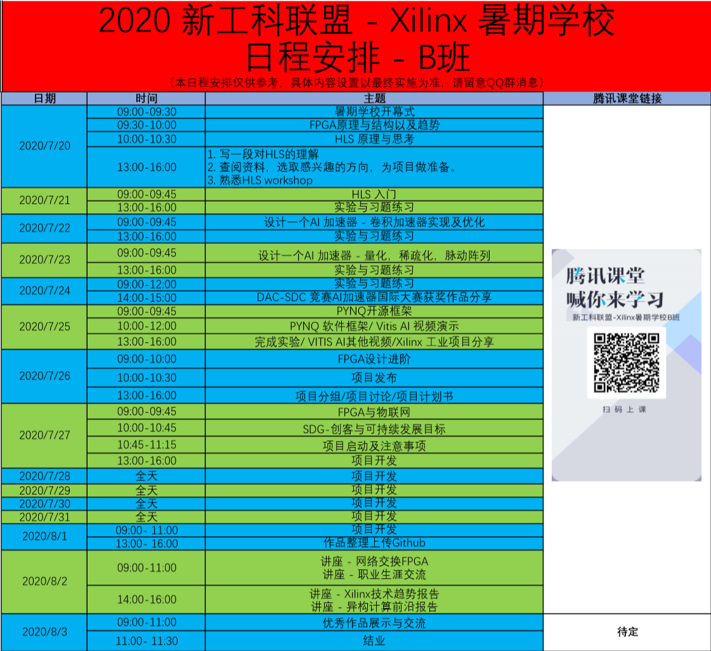
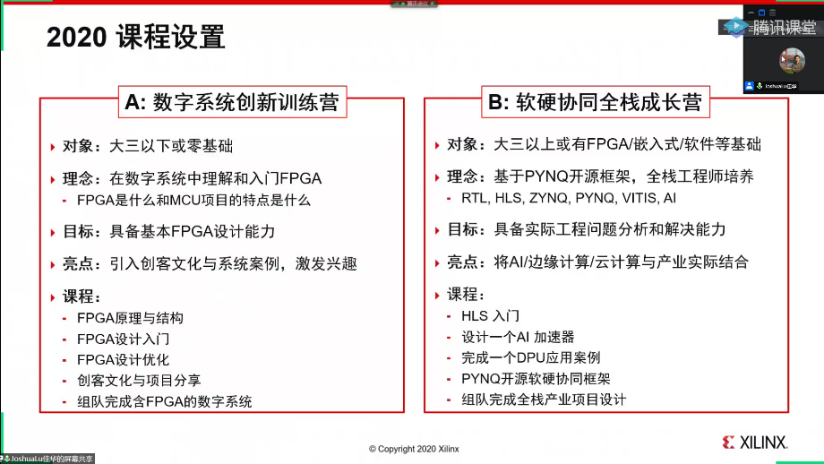
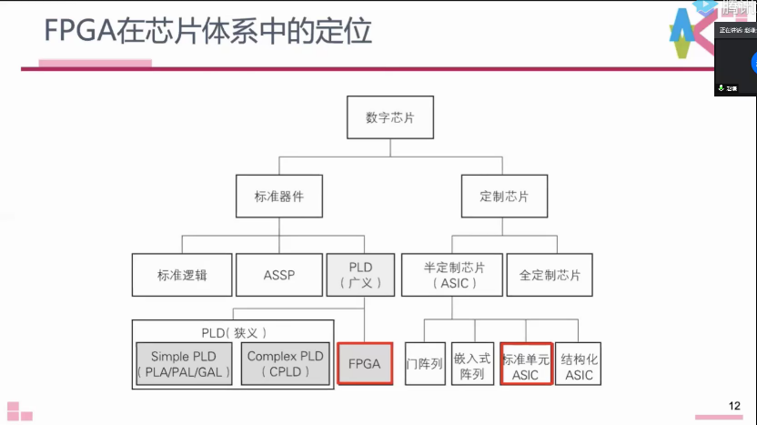
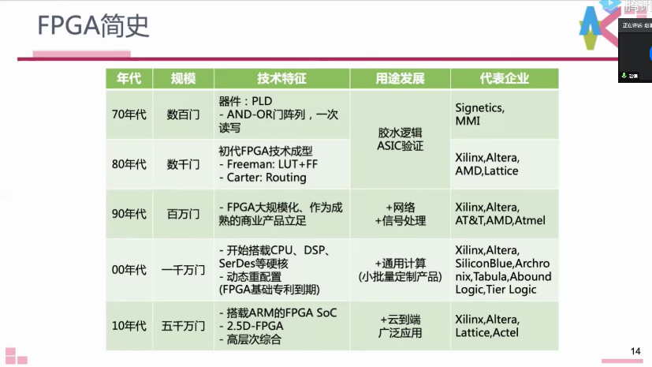

# Xilinx课程Day1
第一天的课程安排主要是开幕式，FPGA以及HLS的简单介绍
## 课程安排

## 开幕式
### 暑期学校基本情况
#### 暑期学校理念
O.P.E.N. Summer School
1. Official 暑期学校的项目是官方的
2. Practice 暑期学校以训练为主，100个小时
3. Evangelist 在进入实验室前的一些训练
4. Network 和同学之间的交流
#### 暑期学校历史
最早是7年前在东南的校内进行，现在71所110学员，今年172所学校，录取了1253人，报名近2000人，包含绝大多数的工科人数，组团与个人结合。

老师有：东南，西南交大，北大，浙大，西电，剑桥，香港，日本，柴火创始人，AWS,Xilinx等来源
#### 暑期学校的特色
1. 传统
    + 免费公益的活动
    + 产业和学术界联合授课
    + 基于项目的训练，100小时实战
    + 在系统设计中加深理解
    + 项目开源及Github分享回去社区
2. 2020年的改进
    + 根据不同水平分为AB班，A班是基础的，B班进阶
    + 提前调整博士生科研交流
3. 动手实践在线学习
    + 低成本的硬件平台
    + 80位主教提前培训和学习
#### 暑期学校的课程安排

不管是A班还是B班都会录屏在网上分享，所以暑期学校之后，可以学习其他班的课程。
## FPGA原理与结构以及趋势-(赵谦-九州工业大学)
<!-- FPGA原理和结构 -->
<!-- CPU自治入门 -->
<!--JonsonXP -->
### FPGA众生相
FPGA的发展史分为三个阶段
1. 80到90年代，TTL的胶水逻辑，因为各家的接口不统一，使用FPGA将系统连接
2. 90年到2015年，用于通信领域
3. 2016至今，FPGA作为CPU的协处理器
4. (未来)体系结构的黄金时代，体系结构的自适应担当，不论在任何平台下，都会提供自适应的无缝开发

FPGA的应用，比如高性能的图像处理、语音处理、通信和实时控制等，以及云端应用。FPGA的云端应用的标志实践是微软Azure云的Catapult项目，然后AWS的F1实例。

云计算和FPGA是天然契合的，因为:
1. 云软件即开即用，
2. 云基础设施，以加速，影响广，
3. 加速器交易市场

### 何谓FPGA

+ PLD是可编程逻辑设备，使用门级电路进行连线实现逻辑，连线冗余多
+ LUT则是基于查找表，布线固定，连线冗余低，更时候大规模的逻辑电路

#### FPGA的简史

#### FPGA结构

#### FPGA经典设计流程

#### FPGA产品

#### FPGA术语
+ 可编程
+ 可重构

### FPGA未来趋势
+ 面向数据中心的ALVEN，之前的产品没有普及，主要限制在外部的带宽限制，而现在的带宽增大使得原先的一些加速有更好的效果
+ 次世代Versal ACAP，是一个众多体系结构的集成，在片上使用告诉网络实现高速高自由的数据交互，使得用户可以自由组合
+ 通过调整ACAP的内置模块，可以划分出面向不同的行业的产品
+ 软硬件协同开发的未来，协同开发平台下，是越来越异构化的结构，面向具体的纵向的行业，会有专门的开发的细分领域开发平台
+ 新的工艺，3D-IC和Chiplet技术，可以提供更多逻辑资源，更多硬核资源，核心间的更大带宽，以及更低成本
+ 未来挑战->高层次工具，编译速度，比特流级别的可移植性，重构速度以及安全性
### 提问
Q：学习FPGA需要什么的知识点，有何种学习路径

A：ennnn，，，等于没答

## HLS原理与思考-(罗国杰)
<!-- 这咋记。。。。 -->
### Q&A
Q：是否要先想好硬件架构，再写HLS

A：看属于那个阶段，如果要很快的出结果，就直接用C，如果要出高质量的版本，需要考虑有哪些模块，思考架构级别的设计，建议第一版用C，之后再思考架构设计，提升效果

Q：HLS再数字IC设计有那些困难，数字IC设计应用HLS的案例

A：HLS的贡献是产品级别的应用是可行的，但是在面对极限的竞争者，使用RTL级别的设计，会有更高的天花板，所以在HLS在关键性能部件会比RTL的设计更弱，一个比较现实的方案是，利用HLS的快速设计，流出关键设计，使用RTL设计提升。希望未来HLS可以更方便的实现HLS与RTL的结合。要依据实际工程的需求去进行选择。
