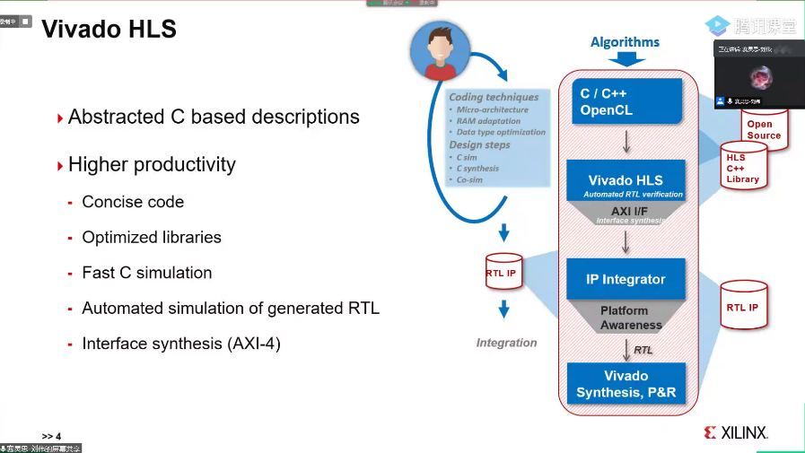
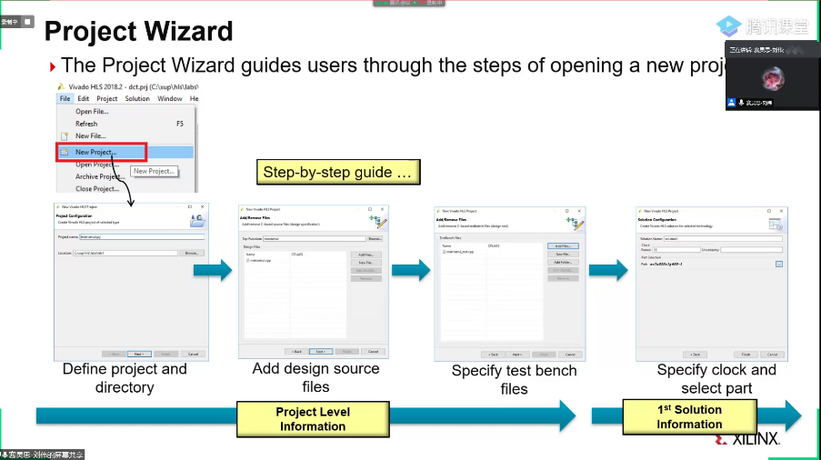
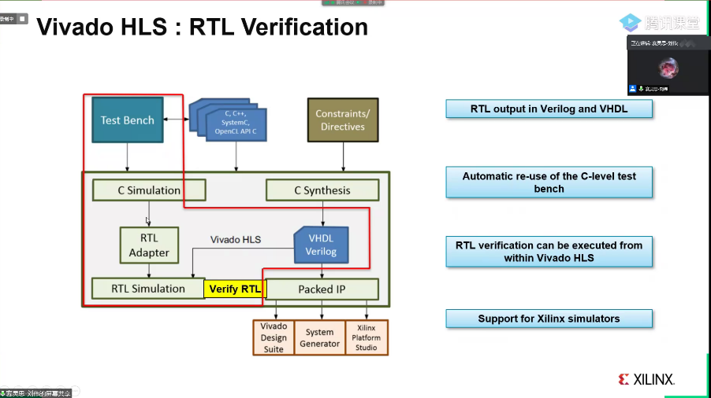
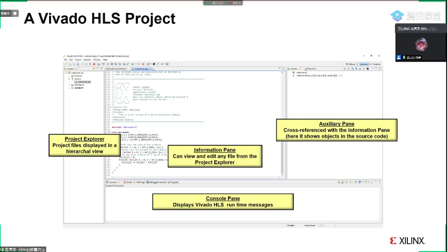
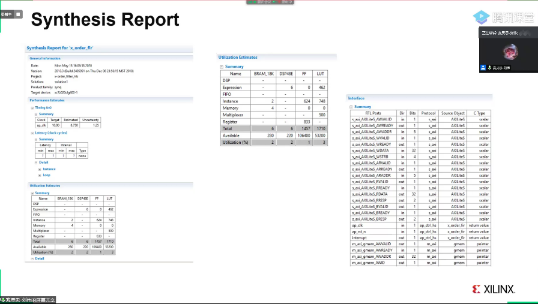
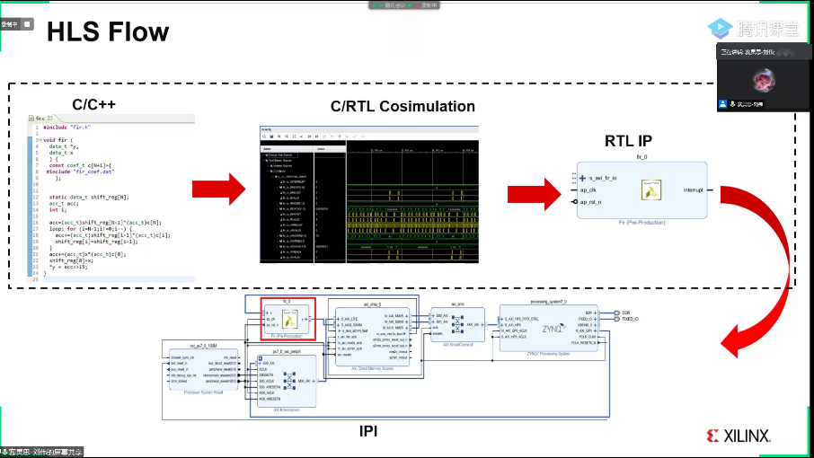
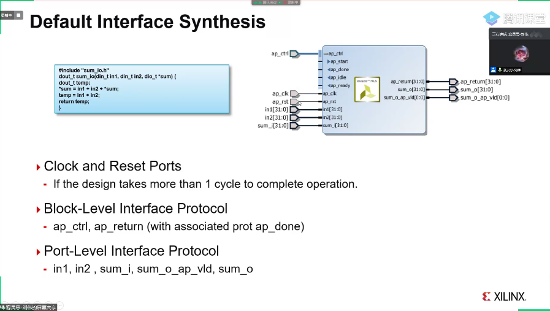

# Xilinx课程Day2
第二天的主要内容是HLS的入门，也是项目的核心内容，主要涉及到一些细节，下午的作业主要是4个HLS实验。

## HLS基础介绍
HLS是高层次综合工具，类似于在单片机上C或C++的编程，由编译器编译为汇编代码，而传统的开发，使用硬件综合语言，难度较高，HLS则是将C或者C++编译到硬件描述语言，然后使用Vivado工具转换为比特流文件。

## HLS设计流程
### 流程

<!-- ？？？？ -->
开发流程如下：
1. 首先创建一个新工程
2. 添加设计的源文件
3. 添加测试文件
4. 配置时钟和选择端口
### 界面
HLS新建后，会有如下的界面：

左侧是文件浏览器，中间是文件的浏览，下册是终端，打印相关的信息，右侧是进行优化的窗口，显示进行了那些优化。
### 报告
当进行仿真后，会产生专门的报告，说明了函数的运行延迟，资源的利用率以及数据接口的定义。例如：

### 导出IP核
在进行仿真之后，可以选择导出RTL，也有对应的结果，如果正确的导出，就会在Implemention下产生对应的IP
### HLS Flow
在产生了IP之后，就可以调用IP，可以进行C/RTL的协同仿真。工具会自动将C的仿真代码转换为TestBench。

### Test Benches
测试用例可以直接使用C/C++去实现，推荐算法和测试用例使用不同文件，直接调用C接口进行验证即可，不需要写硬件综合语言去写。

一个好的测试文件，应该覆盖多数的情况，并且返回0表示通过，1表示失败。

### C仿真
C仿真可以单步的调试执行。

### C/C++的转换
1. 对于加减乘除和赋值，可以直接使用Verilog去实现
2. 对于循环以及条件语句，使用自动机去实现
3. 函数则会自动生成对应的接口

## IP接口
对于C代码，直接对函数接口进行定义即可，但是对于硬件描述语言，还需要考虑接口以何种方式去实现。

比如对于RAM的接口，可以考虑AXI总线进行访问，也可以？？去访问。

一个求和的函数，不使用任何优化，由HLS转换的接口如下：

有三种接口：//直接看Xilinx的介绍视频更好些
1. Clock and Reset
2. Block-Level 接口
3. Port-Level 接口

## 优化
优化不是必须的，但为了提高性能，就需要考虑使用何种的优化。
常用的优化方法：
1. Pipeline，流水线，可以提高并行性，对于一个读，计算，写三步的循环，如果不加入流水线，则会正常按照读，计算，写为一个周期做完后，在进入下一个循环，使用3*n个周期，如果流水线，则不必等待本周期结束，就进入下一个循环的内容，只需n+2个周期
2. Loop Unrolling，循环展开，对于一个循环，如果没有循环间的依赖关系，那么就可以将循环展开，使用一个周期完成多次的循环
3. 函数算法的Pipeline，不仅仅是循环，如果在函数开头加入Pipeline的提示，HLS则会对函数内的循环都进行Pipeline
4. 移除Inter-Loop，如果嵌套循环，内层循环结束后，由于HLS使用自动机去判断当前状态，所以会浪费额外周期，HLS可以使用Inter-Loop，将内层循环的两次之间判断周期省去
5. C数组优化，对于C程序，数组访存和写入要分为两个周期，如果使用双端口的DRAM，可以将两次循环之间的读写合并在一个周期，进行加速。
6. Partition and Reshaping，对于Partition，数组可以放入不同的RAM当中，从而提升性能。对于Reshaping，不同的数组可以进行拼接。
7. C常量初始化，建议使用static去定义，这样HLS可以直接写入比特流文件，不要再一次的写入
8. Dataflow，用于不同的函数之间优化的方法，比如对于一个输入数据处理，第一个函数写入buf当中，第二个函数从buf取数据，如果不进行优化，则是运行完第一个函数后，再运行第二个函数；而如果使用DataFlow，则会对此优化，减少中间缓存的需要。

## 实验介绍
1. 实验1是矩阵乘法，主要是流程熟悉
2. 实验2是滤波的实验，使用Pipeline，TripCount和DataFlow的优化
3. 实验3是DCT算法，DataFlow和Reshape的优化
4. 实验4是FIR滤波器，可以给板卡输入相关音频，可以插上耳机听效果。